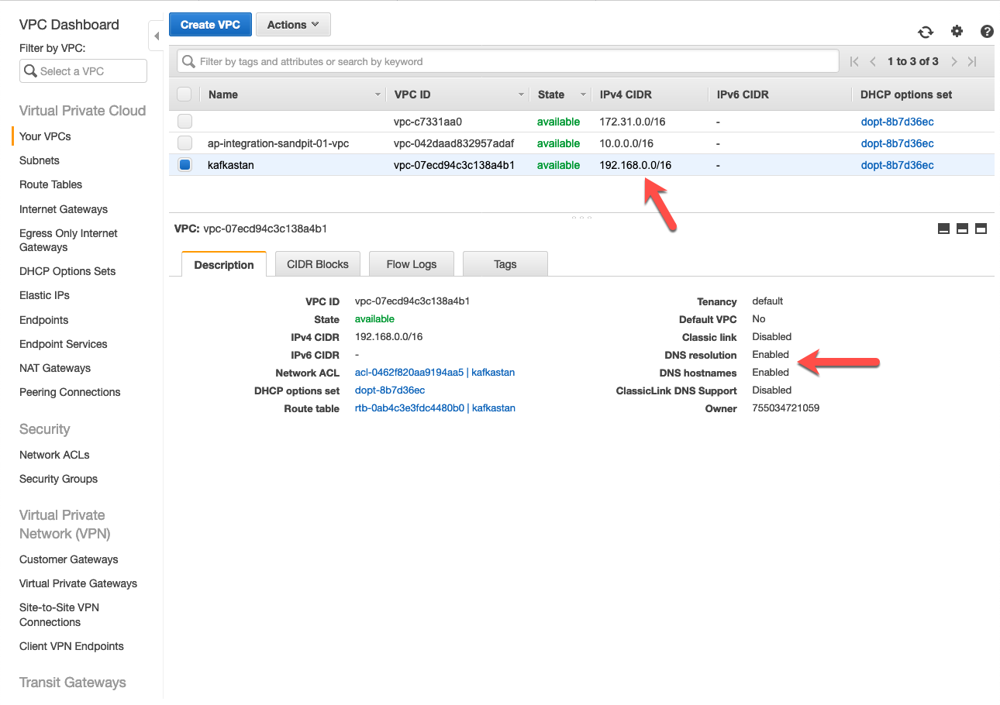
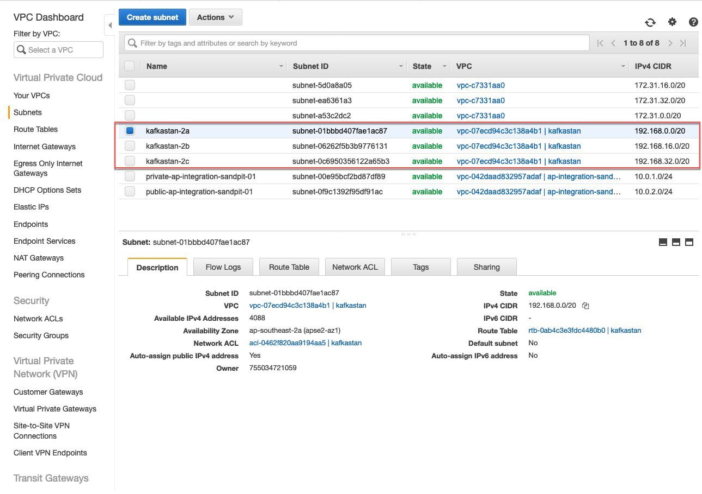
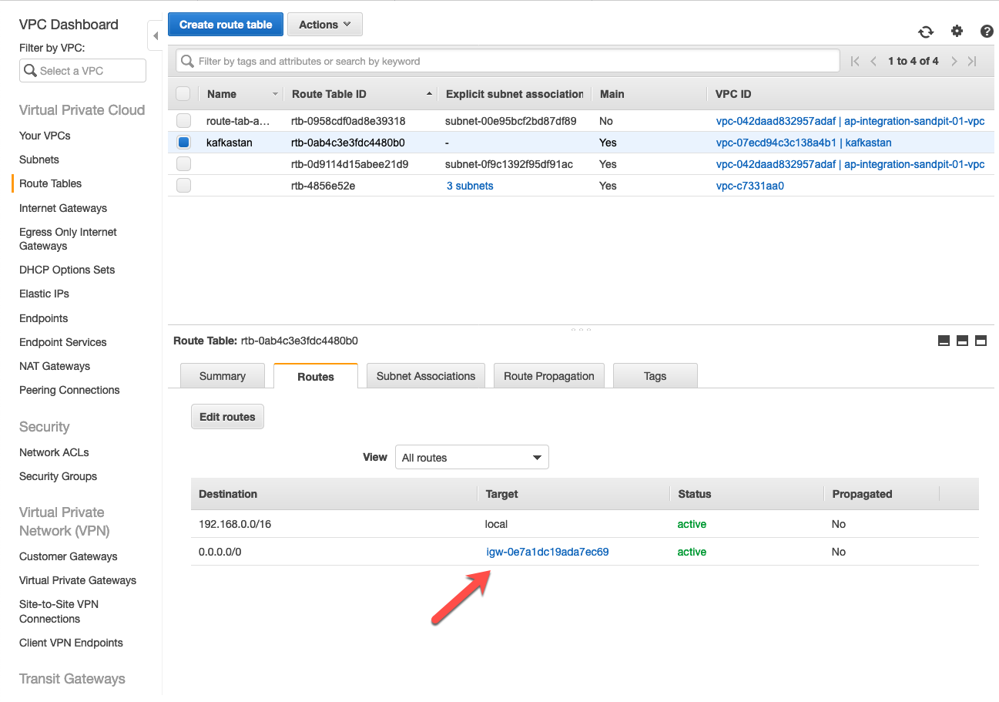
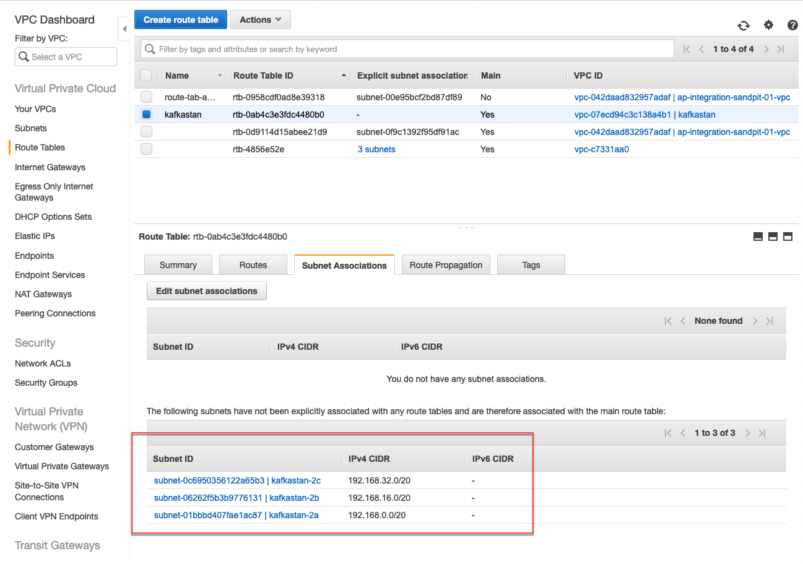
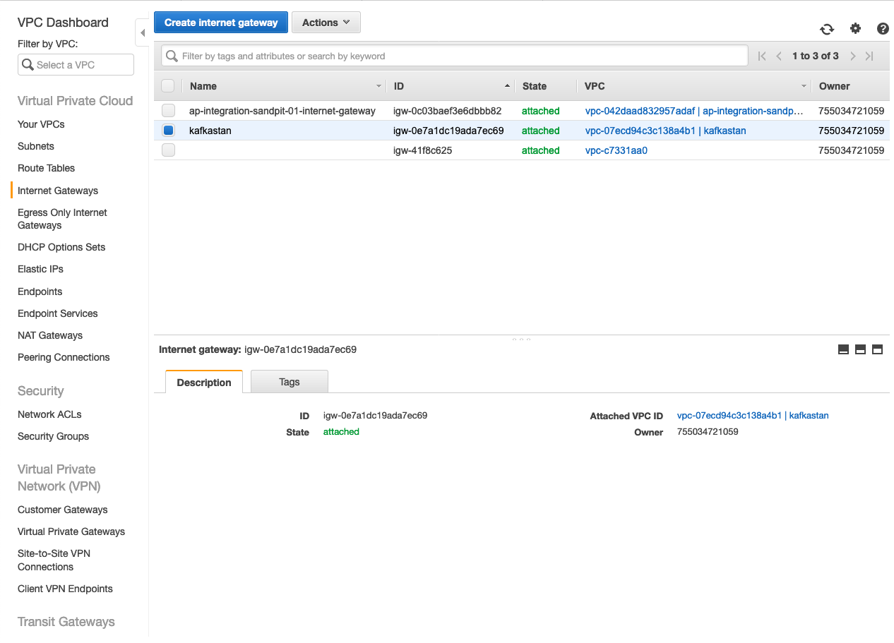
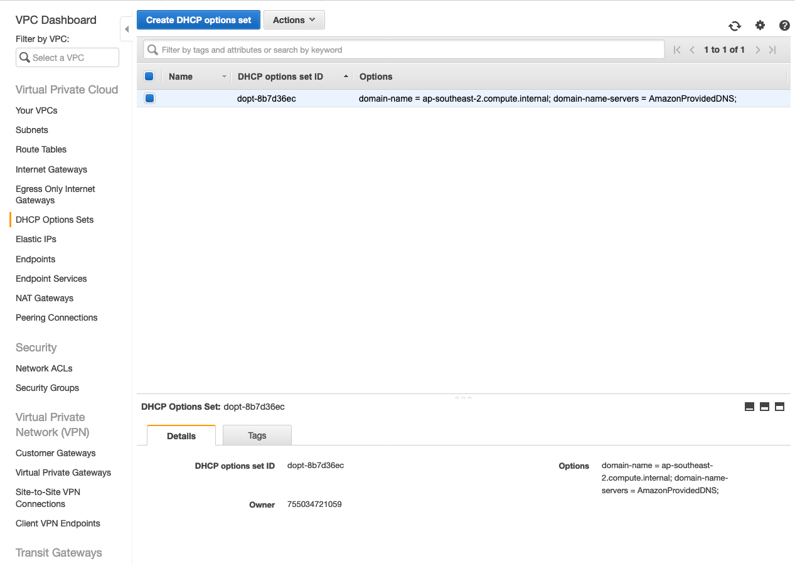
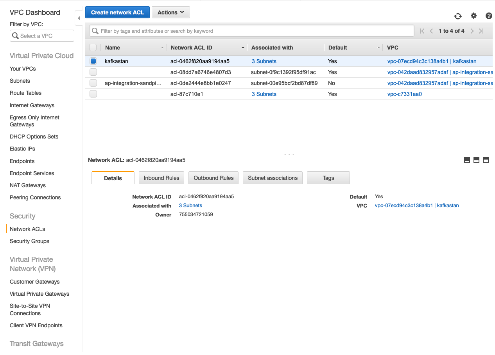
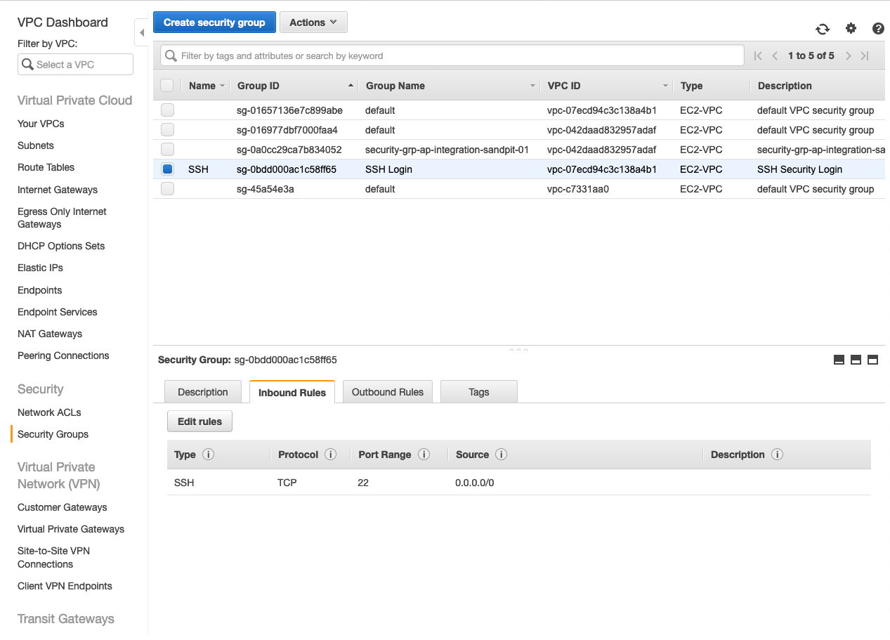

AWS VPC
=======

Step by step setting up VPC in AWS and allow SSH access to EC2 instance.

VPC

Subnets

Route Tables

Subnets in Route Tables

Internet Gateways

DHCP Options Sets

Network ACLs

Security Groups

EC2 instance

image::VPC - EC2.png[EC2]

References
----------
