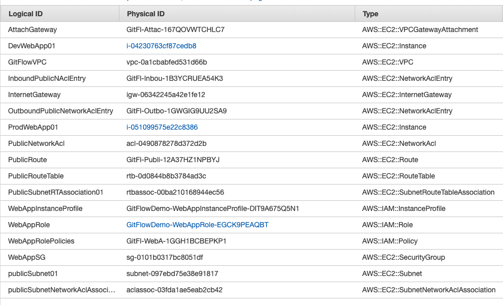
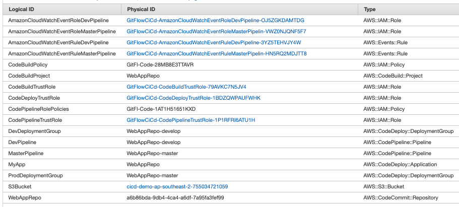
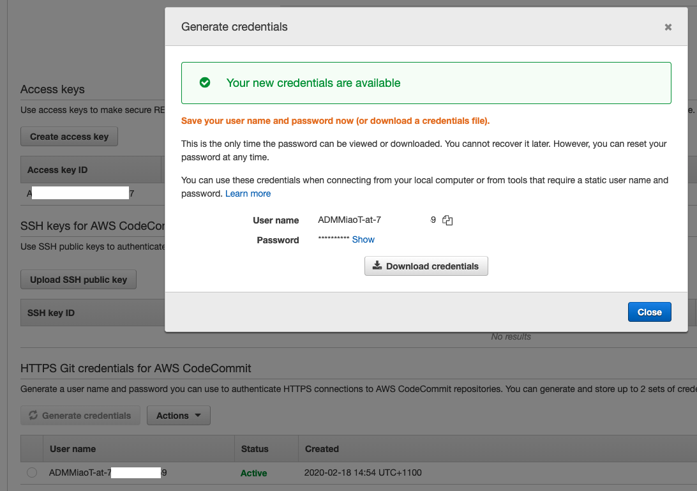

GitFlow with AWS Developer Tools
================================

Implementing GitFlow by using AWS Developer Tools - AWS CodeCommit, AWS CodeBuild, and AWS CodeDeploy, AWS CodePipeline.

- Create GitFlow Runtime Farmer stack in AWS CloudFormation

- Create GitFlow CI / CD stack in AWS CloudFormation

- Create GitFlow HTTPS Git Credentials

[source.console]
----
𝜆 aws cloudformation create-stack --profile personal --stack-name GitFlowDemo --template-body https://s3.amazonaws.com/devops-workshop-0526-2051/git-flow/aws-devops-workshop-environment-setup.template --capabilities CAPABILITY_IAM

𝜆 aws cloudformation create-stack --profile personal --stack-name GitFlowCiCd --template-body https://s3.amazonaws.com/devops-workshop-0526-2051/git-flow/aws-pipeline-commit-build-deploy.template --capabilities CAPABILITY_IAM --parameters ParameterKey=MainBranchName,ParameterValue=master ParameterKey=DevBranchName,ParameterValue=develop

𝜆 aws cloudformation update-stack --profile personal --stack-name GitFlowCiCd --template-body https://s3.amazonaws.com/devops-workshop-0526-2051/git-flow/aws-pipeline-commit-build-deploy-update.template --capabilities CAPABILITY_IAM --parameters ParameterKey=MainBranchName,ParameterValue=master ParameterKey=DevBranchName,ParameterValue=develop ParameterKey=FeatureBranchName,ParameterValue=feature-x

𝜆 aws cloudformation update-stack --profile personal --stack-name GitFlowCiCd --template-body https://s3.amazonaws.com/devops-workshop-0526-2051/git-flow/aws-pipeline-commit-build-deploy.template --capabilities CAPABILITY_IAM --parameters ParameterKey=MainBranchName,ParameterValue=master ParameterKey=DevBranchName,ParameterValue=develop
----

References
----------

- Implementing GitFlow Using AWS CodePipeline, AWS CodeCommit, AWS CodeBuild, and AWS CodeDeploy, _https://aws.amazon.com/blogs/devops/implementing-gitflow-using-aws-codepipeline-aws-codecommit-aws-codebuild-and-aws-codedeploy/_